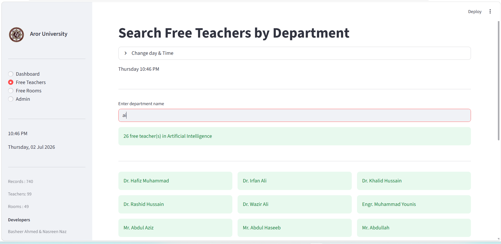
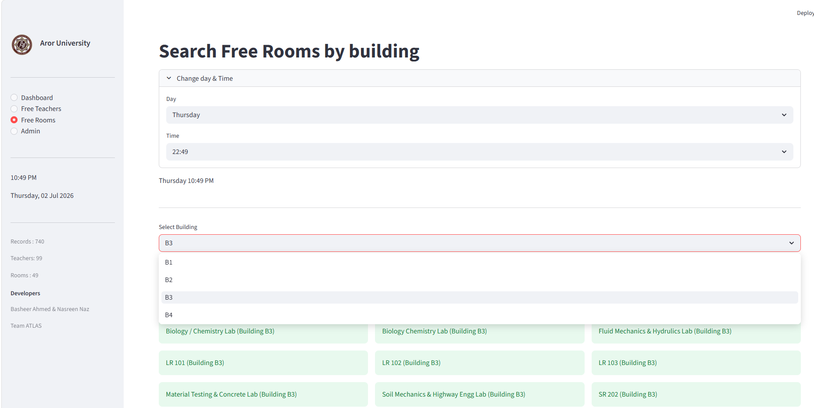
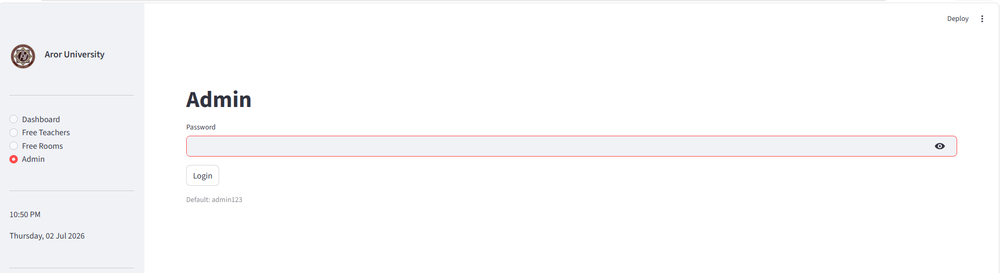
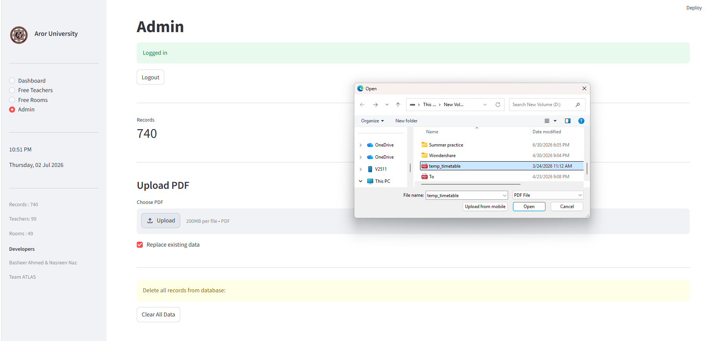

# 🚀 ATLAS: Aror Timetable and Live Allocation System

### "Transforming chaotic university schedules into a real-time, data-driven campus intelligence engine."

---

## 🌟 Why ATLAS? (Executive Summary)
Every semester, universities roll out dense, massive timetable PDFs that are incredibly painful for students and faculty to navigate. Finding an active class, tracking down an available teacher, or locating an empty room for a makeup lecture usually involves endless scrolling and confusion. 

**ATLAS solves this elegantly.** By combining automated PDF parsing algorithms with an interactive, high-performance web dashboard, ATLAS extracts structural data instantly and converts it into live, actionable campus insights. It is a full-stack engineering solution that bridges the gap between static administrative documents and real-time user needs.

---

## 🔥 Key Highlights to Impress
* **Zero Manual Data Entry:** Uses advanced Regular Expression (Regex) engines and programmatic page-streaming to rip data directly from official multi-page PDFs with 100% accuracy.
* **Instant Spatial Intelligence:** Computes the exact current time to map out every active class running across the entire university, organized dynamically by building and floor.
* **Smart Resource Optimization:** Features an algorithmic lookup engine that cross-references time slots to instantly locate empty classrooms and free faculty members.
* **Enterprise-Ready Infrastructure:** Built with a self-healing database layer. On the very first run, the system automatically audits, compiles, and spins up the required MySQL schemas without requiring database administrators.

---

## 📸 System Previews & Application UI

Here is a live visual walkthrough of the ATLAS system interfaces:

### 📊 Live Schedules & Allocation Dashboard
Displays real-time ongoing classes across various academic buildings dynamically.

| 🏢 Building B1 View | 🏢 Building B2 View |
| :---: | :---: |
|  |  |

---

### 🔍 Resource & Faculty Search Optimization
Algorithmic lookup engines to instantly track vacant rooms and free faculty members.

| 👨‍🏫 Search Free Teachers by Department | 🗺️ Vacant Room Finder (Building Search) |
| :---: | :---: |
|  |  |

| 🏫 Specific Building Floor Plan View |
| :---: |
|  |

---

### ⚙️ Secure Administrative Control Panel
Protected view for institutional admins to upload PDF timetables and manage database configurations.

| 🔒 Admin Authentication | 📥 Structural PDF Parser & Data Upload |
| :---: | :---: |
|  |  |

---

## 🛠️ System Architecture & Tech Stack
* **Language:** Python 3.10+
* **Frontend UI Engine:** Streamlit
* **Data Core & Parsing:** `pdfplumber`, `pandas`, `re` (Regex)
* **Database Management System:** MySQL Server

---

## 👥 Contributors
* **Basheer** - Backend Core Architecture, Regex Formulation, Database Schema Design.
* **Nasreen** - Frontend UI Development, Streamlit Stateful Management, Optimization Logic.
